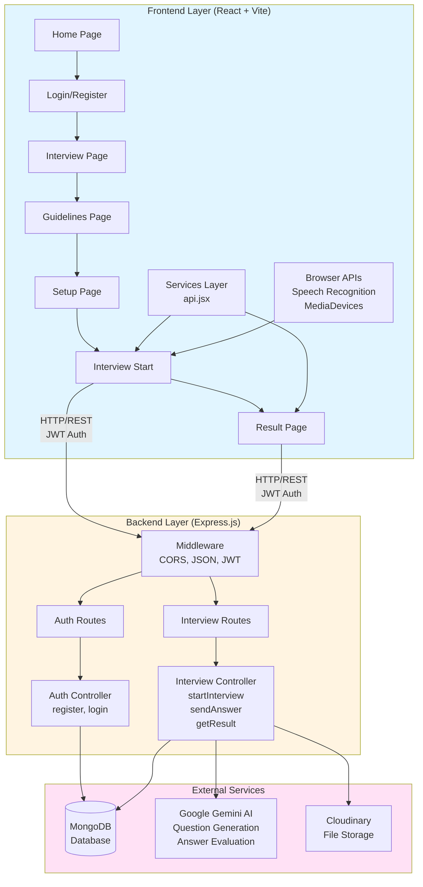
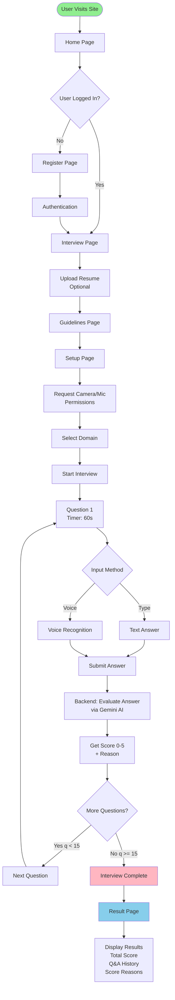
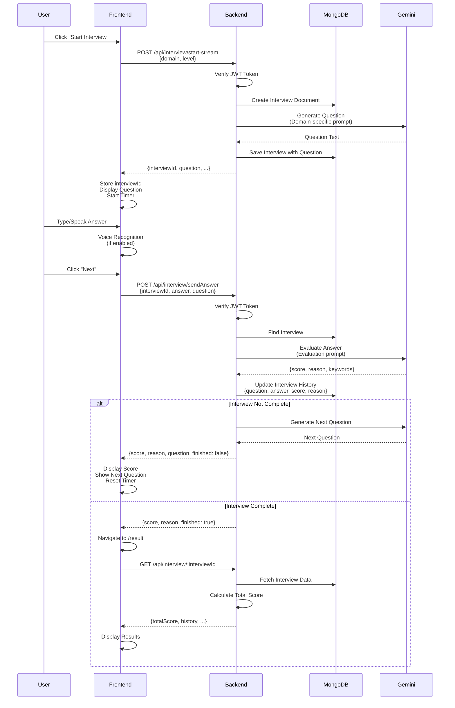
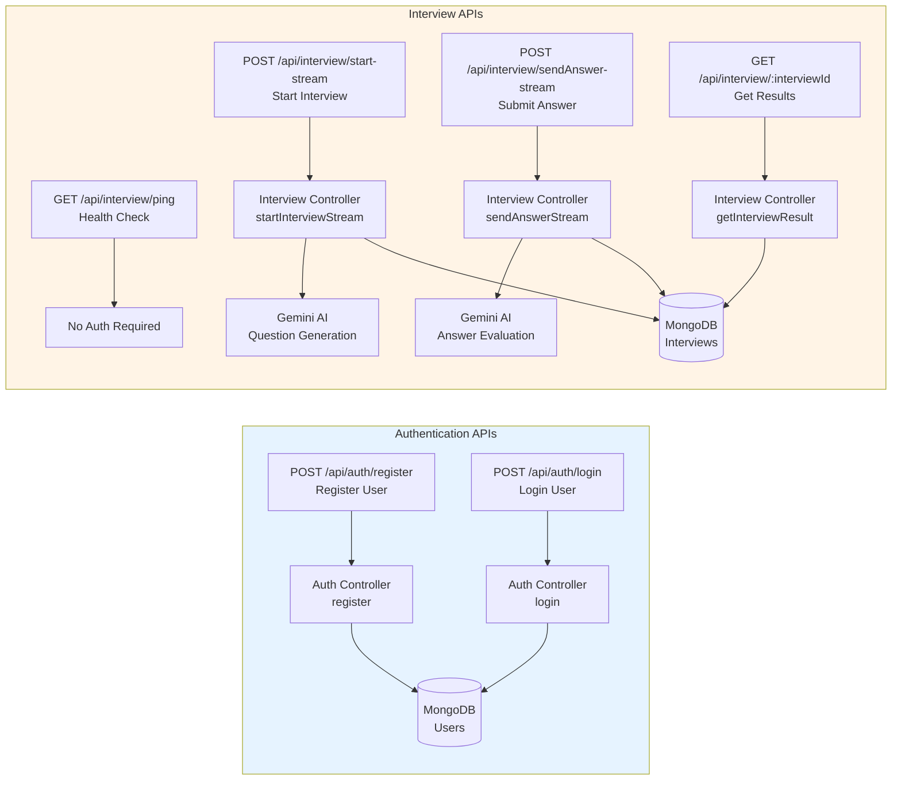
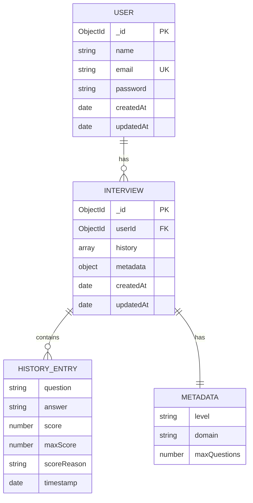
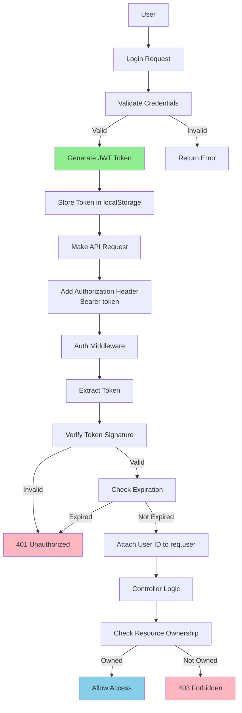
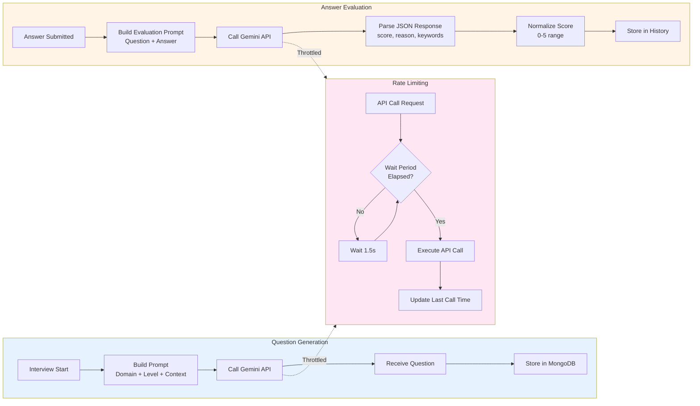
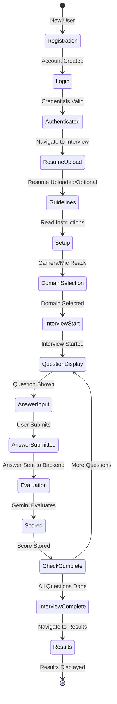
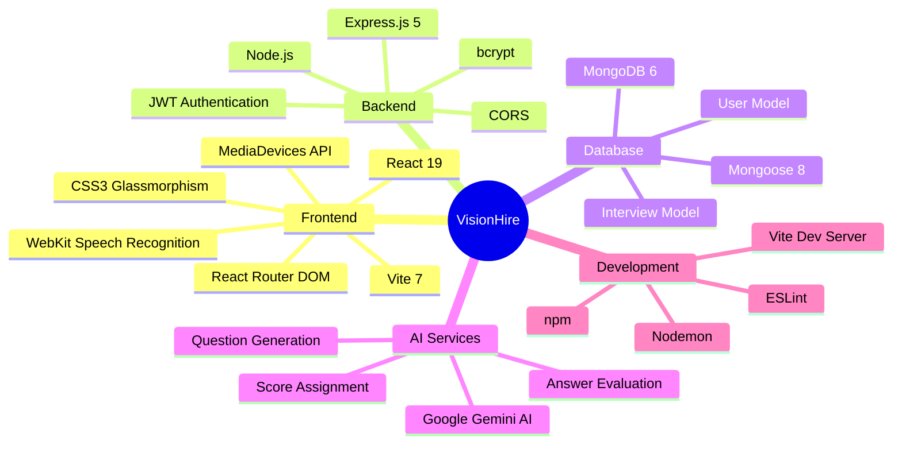

# VisionHire - Mermaid Diagrams for Presentation

## 1. System Architecture Diagram



## 2. User Flow Diagram



## 3. Component Structure

```mermaid
graph TD
    App[App.jsx<br/>Root Router] --> Home[Home.jsx]
    App --> Login[Login.jsx]
    App --> Register[Register.jsx]
    App --> Interview[Interview.jsx]
    App --> Guidelines[Guidelines.jsx]
    App --> Setup[Setup.jsx]
    App --> InterviewStart[InterviewStart.jsx]
    App --> Result[Result.jsx]
    
    Home --> Navbar1[Navbar.jsx]
    Login --> Navbar2[Navbar.jsx]
    Register --> Navbar3[Navbar.jsx]
    Interview --> Navbar4[Navbar.jsx]
    Guidelines --> Navbar5[Navbar.jsx]
    Setup --> Navbar6[Navbar.jsx]
    Setup --> CameraHandler[Camera/Mic Handler]
    Setup --> DomainGrid[Domain Selection Grid]
    
    InterviewStart --> Navbar7[Navbar.jsx]
    InterviewStart --> QuestionDisplay[Question Display]
    InterviewStart --> AnswerInput[Answer Input Section]
    InterviewStart --> Timer[Timer Component]
    InterviewStart --> Progress[Progress Bar]
    InterviewStart --> Controls[Control Buttons]
    
    AnswerInput --> Textarea[Textarea<br/>Manual Input]
    AnswerInput --> VoiceRec[Voice Recognition<br/>WebKit API]
    
    Result --> Navbar8[Navbar.jsx]
    Result --> ScoreCard[Score Summary Card]
    Result --> QAList[Q&A History List]
    QAList --> QAItem[Q&A Item<br/>Question, Answer<br/>Score, Reason]
    
    style App fill:#FFE4B5
    style InterviewStart fill:#E0FFFF
    style Result fill:#F0E68C
```



## 4. Data Flow - Interview Process



## 5. API Architecture



## 6. Database Schema



## 7. Security Flow



## 8. AI Integration Flow



## 9. Interview Lifecycle



## 10. Technology Stack Overview



---

## How to Convert to Images

### Option 1: Mermaid Live Editor (Recommended)
1. Go to https://mermaid.live
2. Copy any diagram code (between ```mermaid and ```)
3. Paste into the editor
4. Click "Actions" → "Download PNG" or "Download SVG"

### Option 2: VS Code Extension
1. Install "Markdown Preview Mermaid Support" extension
2. Open this file in VS Code
3. Right-click on the preview → "Export as PNG/SVG"

### Option 3: Online Converters
- https://mermaid.ink (for direct image URLs)
- https://kroki.io (supports Mermaid)

### Option 4: Command Line (if you have Node.js)
```bash
npm install -g @mermaid-js/mermaid-cli
mmdc -i DIAGRAMS_MERMAID.md -o output.png
```

---

**Note**: Each diagram above can be copied individually and converted to an image. The diagrams are optimized for presentation use with clear labels and professional styling.

